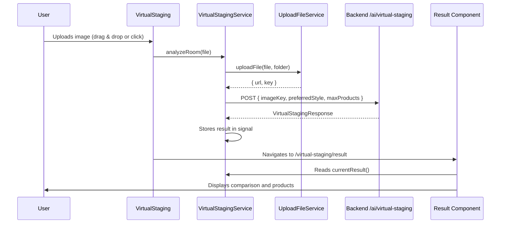

# Virtual Staging Feature

## Overview

Virtual Staging is a feature that allows users to upload an image of an empty room and receive:
1. An AI-generated image with virtual furniture
2. Suggested products from the catalog that match the design

## Architecture

```
src/app/
├── core/
│   ├── models/ai/
│   │   └── virtual-staging.models.ts    # Request/Response interfaces
│   └── services/virtual-staging/
│       └── virtual-staging.ts           # Main service
└── features/virtual-staging/
    ├── virtual-staging.ts               # Upload component
    ├── virtual-staging.html             # Upload template
    ├── virtual-staging.css              # Upload styles
    ├── virtual-staging.routes.ts        # Module routes
    └── result/
        ├── result.ts                    # Results component
        ├── result.html                  # Results template
        └── result.css                   # Results styles
```

## Data Flow



## Models

### VirtualStagingRequest
```typescript
interface VirtualStagingRequest {
    imageKey: string;       // File key in Storage
    preferredStyle: string; // E.g.: 'modern', 'classic'
    maxProducts: number;    // Maximum suggested products
}
```

### VirtualStagingResponse
```typescript
interface VirtualStagingResponse {
    analysis: StagingAnalysis;
    suggestedProducts: StagingProduct[];
    stagedImageUrl: string;
    metadata: StagingMetadata;
}
```

### StagingProduct
```typescript
interface StagingProduct {
    id: string;
    title: string;
    description: string;
    price: number;
    imageUrl: string;
    score: number;      // Relevance 0-1
    matchType: string;  // 'exact', 'similar', 'category'
}
```

## Components

### VirtualStaging (Upload)
**Route:** `/virtual-staging`

Handles image upload with:
- Drag & drop support
- Click to select file
- Type validation (images only)
- Loading state with spinner

### Result
**Route:** `/virtual-staging/result`

Displays:
- Image comparison slider (original vs decorated)
- Suggested products using shared `ProductCard`
- Download button for generated image

#### Comparison Slider
Uses CSS `clip-path` to reveal/hide the original image over the generated one:
```html
<div [style.clip-path]="'polygon(0 0, ' + sliderPosition() + '% 0, ...)'">
```

#### Product Mapping
API products (`StagingProduct`) are adapted to the `Product` model to reuse the shared component:
```typescript
mapToProduct(stagingProduct: StagingProduct): Product
```

## VirtualStagingService

### Signals (State)
- `currentResult`: Result of the last analysis
- `originalImageUrl`: URL of the uploaded original image

### Methods
- `analyzeRoom(file: File)`: Uploads image and runs analysis
- `clearState()`: Clears current state

## API Endpoint

**POST** `/ai/virtual-staging`

**Request Body:**
```json
{
  "imageKey": "virtual-staging/uploads/abc123.jpg",
  "preferredStyle": "modern",
  "maxProducts": 3
}
```

**Response:**
```json
{
  "analysis": {
    "roomType": "living room",
    "style": "modern",
    "emptyAreas": ["center", "corner"],
    "suggestedFurniture": ["sofa", "coffee table"],
    "colorPalette": ["#F5F5DC", "#8B4513"]
  },
  "suggestedProducts": [...],
  "stagedImageUrl": "https://storage.../staged-image.png",
  "metadata": {
    "processingTimeMs": 5420,
    "productsFound": 3
  }
}
```

## Download Feature

The `Result` component allows downloading the generated image:
```typescript
async downloadImage(): Promise<void> {
    const response = await fetch(imageUrl);
    const blob = await response.blob();
    // Creates temporary link and triggers download
}
```

## Routes

```typescript
export const VIRTUAL_STAGING_ROUTES: Routes = [
    { path: '', component: VirtualStaging },
    { path: 'result', component: Result }
];
```

## Dependencies

- `UploadFileService`: File uploads to Google Cloud Storage
- `ProductCard`: Shared component for displaying products
- `LoggerService`: Error and event logging
